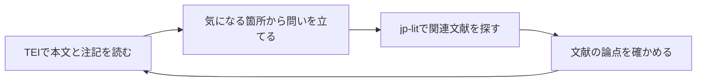

# TEIの使い方: 漱石・古典・歴史史料を探して読む

TEIは、文学作品や歴史史料の本文に、章・歌・人物・注記・訂正などの情報を付けて扱うための共通の記述方法です。このガイドでは、漱石『こころ』と廣瀬本万葉集を例に、研究での使い道、公開データの探し方、jp-litで本文の読解と関連文献の調査を往復する手順を説明します。

初めての方は、次の順に読むと資料を探すところから始められます。保存済みXMLがある方は[AIに依頼して読む](#aiに依頼して読む)へ進めます。

1. [TEIとは何か](#teiとは何か)
2. [研究・読解に使う具体例](#研究読解に使う具体例)
3. [公開されているTEIの例](#公開されているteiの例)
4. [jp-litが支える作業](#jp-litが支える作業)
5. [TEI読解と文献調査を往復する](#tei読解と文献調査を往復する)
6. [jp-litで公開TEIを探す](#jp-litで公開teiを探す)
7. [AIへの読解依頼](#aiに依頼して読む)と[CLIの導入](#導入)

## TEIとは何か

TEIは**Text Encoding Initiative**の略です。TEI Consortiumが、人文学資料を電子的に記録・交換するためのガイドラインを整備しています。本文をXMLという形式で記述し、「ここは段落」「この語は人物名」「この部分は後から書き加えられた」といった情報をタグで付けます。このガイドで扱う「TEIデータ」「TEI/XML」は、その記述方法を使って作成されたXMLファイルです。[TEIの公式紹介](https://tei-c.org/about/)と[XMLの入門](https://tei-c.org/release/doc/tei-p5-doc/en/html/SG.html)で基本を確認できます。

たとえば、漱石作品の人物や場所を調べる場面を考えてみます。次は説明用に作った模式例です。

```xml
<p xmlns="http://www.tei-c.org/ns/1.0">
  <persName ref="#watakushi">私</persName>は
  <placeName>鎌倉</placeName>で
  <persName ref="#sensei">先生</persName>と話した。
</p>
```

`p`は段落、`persName`は人物名、`placeName`は地名です。`ref="#sensei"`は、同じXML内の`sensei`というIDへの参照を表します。本文の文字に加えて、誰を指す語か、どこを指す語かを記録できるため、人物の登場箇所を抜き出したり、地名をたどったりする材料になります。模式例の文は『こころ』の引用ではありません。

| TEIに記録できる情報 | タグの例 | 読解で役立つこと |
| --- | --- | --- |
| 章・節・段落 | `div`、`head`、`p` | 読む範囲を絞り、元の位置へ戻る |
| 歌・詩行 | `lg`、`l` | 歌単位・行単位で本文や訓を確認する |
| 人物・地名・発話 | `persName`、`placeName`、`said` | 登場人物や会話、場所の記述をたどる |
| 原表記・正規化表記、誤記・訂正 | `choice`の`orig/reg`、`sic/corr` | どちらの表記を採用したかを説明する |
| 削除・加筆・注記 | `subst`、`del`、`add`、`note` | 書き入れや訂正を本文と区別して読む |
| 底本・編者・作成方針 | `teiHeader`内の記述 | 何をもとに誰が作ったデータかを調べる |

**TEIには、データを作った人の判断も記録されています。** 人物の同定、章の分け方、正規化や訂正の採用は、そのデータの作成方針に依存します。すべてのTEIに上の情報がそろうわけではなく、同じ作品でも底本やタグ付けが違います。研究では本文とともに、編者・底本・対象範囲・作成方針を読みます。

## 研究・読解に使う具体例

### 漱石『こころ』で人物と発話をたどる

[Digital Soseki Projectの『こころ』TEI](https://github.com/Yosh-Hibi/digital-soseki/blob/52db835185c05aac0e1ca62e8f465de612041c6e/data/tei/soseki/digital-soseki-kokoro-tei.xml)では、「上　先生と私」「中　両親と私」「下　先生と遺書」が章の区切りとして記録され、その内側に節と段落があります。人物名の`persName`、発話の`said`、地名の`placeName`なども付いています。

たとえば「『私』と『先生』の関係が、冒頭の語りと会話でどう描かれるか」を読むなら、まず「上　先生と私」の最初の節を取り出します。本文の流れを読みながら、誰の発話としてタグ付けされているか、人物名の参照がどう付いているかを確認し、気になる箇所へ戻れる位置を残します。

jp-litは、章・節を一覧にして該当箇所を抽出し、人物・発話のタグを保った読解材料を作れます。登場人物への帰属や分類タグはデータ側の注釈として読み、作品解釈は本文と照合して組み立てます。公開者もタグ付け精度の修訂を予定しています。[研究代表者の紹介](https://hibi.hatenadiary.jp/entry/2026/06/18/160325)から、プロジェクトの目的と公開範囲を確認できます。

### 廣瀬本万葉集で歌本文・訓・書き入れを分けて読む

[廣瀬本万葉集の公開TEI](https://github.com/kokubunken/nijl-manyoshuTEI)は、写本の翻刻と書き入れを構造化した例です。確認した[XMLの版](https://github.com/kokubunken/nijl-manyoshuTEI/blob/1ac23ae48ded9f832823b96b9cb54d1d86852ddc/manyo_hirose_v06_0001-0234,3348-3577_202603.xml)では、国歌大観番号4に対応する`lg`のIDが`manyo0004`で、その内側に本文の`l`と訓の`l`があり、`corresp`で対応付けられています。

たとえば「第4番の本文と訓を対応させて読みたい」「ある歌の訂正や書き入れを、本文へ混ぜずに確認したい」という問いに使えます。jp-litで歌を特定し、本文・訓・注記をそれぞれの要素と位置を保って取り出します。別の歌に進む際も、番号だけで決めず、そのXML内で一致する候補を確認します。

表記の選択や訂正を記録したTEIでは、次のような構造も現れます。こちらは意味を説明する自作の模式例です。

```xml
<choice xmlns="http://www.tei-c.org/ns/1.0">
  <orig>けふ</orig><reg>きょう</reg>
</choice>
```

`orig`は原表記、`reg`は正規化した表記を表します。jp-litのreaderは両方を保持します。原表記で読むか、読みやすい表記へ整えるかを後から選び、その選択を研究ノートへ記録できます。廣瀬本の確認版には、`subst`の中で`del`と`add`を組み合わせた訂正、`note`の注記、画像との対応もあります。画像を見ながら読む際は、公開元の[廣瀬本萬葉集ビューワ](https://tei.pages.nijl.ac.jp/manyoshuteiviewer/)が入口になります。

### 歴史史料で本文と注記・訳を対照する

TEIは日記・書簡・法制史料にも使われます。たとえば国立歴史民俗博物館は[延喜式の校訂文・現代語訳・英訳のTEIデータ](https://khirin-r.rekihaku.ac.jp/doku.php?id=%E5%BB%B6%E5%96%9C%E5%BC%8Ftei%E3%83%87%E3%83%BC%E3%82%BF%E3%82%BB%E3%83%83%E3%83%88)を公開しています。本文の一項目を切り出し、訳や校訂の判断を対照する研究の入口になります。

日記や書簡なら、記録の一項目を抽出して日付・人物・場所・校訂注を確認する使い方が考えられます。これは読解の提案で、利用できるタグや本文と訳の対応方法は資料ごとに調べます。日付の換算、人物同定、訳の評価、底本との校合は、原資料に戻って判断します。

## 公開されているTEIの例

以下は2026年10月3日に公開元の案内を確認した、探索の入口です。研究上の問いに合うデータを選び、収録範囲と底本を確かめてから使います。

| 公開資料・入口 | どんなデータか | 研究・読解の出発点 |
| --- | --- | --- |
| [デジタル漱石](https://github.com/Yosh-Hibi/digital-soseki/tree/main/data/tei/soseki) | 『吾輩は猫である』『坊つちやん』『こころ』『明暗』など長篇14作品のTEI | 章・節をたどり、人物・発話などのタグを本文と照合する |
| [廣瀬本万葉集](https://github.com/kokubunken/nijl-manyoshuTEI) | 写本の翻刻、訓、書き入れなどを扱うTEI。公開範囲はファイルごとに確認する | 歌本文と訓、訂正・注記、底本画像の関係を読む |
| [校異源氏物語テキストDB](https://kouigenjimonogatari.github.io/) | 『校異源氏物語』に基づくTEI/XMLと底本画像への対応 | 帖別の本文や和歌を読み、底本の該当箇所へ戻る |
| [延喜式TEIデータセット](https://khirin-r.rekihaku.ac.jp/doku.php?id=%E5%BB%B6%E5%96%9C%E5%BC%8Ftei%E3%83%87%E3%83%BC%E3%82%BF%E3%82%BB%E3%83%83%E3%83%88) | 校訂文・現代語訳・英訳をTEI化した歴史史料 | 項目単位の読解と本文・訳の対照を始める |

このreaderで構造と操作を確認した実資料は、上で版を示した『こころ』と廣瀬本万葉集です。源氏物語・延喜式は公開案内を確認した探索候補で、このガイドでreader動作を検証した資料には含めていません。新しいXMLでは、まず文書検査と構造一覧から始めます。

## jp-litが支える作業

jp-litは、研究の問いから資料を探し、保存したTEIの必要な箇所を読む流れを支えます。AIから文献DBを使う**MCP**、AI用の手順書である**Skill**、手元のXMLを処理するコマンドである**CLI**が、それぞれ次の作業を担います。

| 作業 | jp-litの機能 | 得られるもの |
| --- | --- | --- |
| 作品・底本・関連研究を探す | jp-lit MCPの書誌検索 | 論文・図書・古典籍の候補と出典 |
| 公開TEIを探し、取得版を確かめる | `jp-lit-tei` Skillと通常のWeb検索・公開元の確認 | 公開先、対象範囲、底本、版、利用条件の記録 |
| 保存XMLの構造を調べ、必要な箇所を取り出す | `jp-lit-tei-reader` CLI | 章・歌などの一覧、本文とタグ、元XML内の位置 |
| 読解・比較・引用を組み立てる | 取得した結果を用いる研究者とAI | 原記述と解釈を分けた研究ノート・読解案 |

readerは、文書検査、構造一覧、構造付き抽出、参照点検の4操作を提供します。全文を一度にAIへ渡す前に、読む章や歌を絞って、その範囲の注記や訂正も一緒に確認できます。語の出現集計や複数作品の比較分析は、抽出後の分析として別に行います。

読解結果には、ファイルの版を識別する**SHA-256（hash）**と、XML内の位置を指す**locator**が付きます。hashはファイルの指紋、locatorのXPathは要素へ戻るための道順と考えると使いやすくなります。これらはXMLの版と位置を示し、底本の頁番号はデータ内の頁記述から別に確認します。

本文の採用、人物への発話の帰属、解釈、画像の実見・校合は研究者が確かめます。readerはXML内の記述を保持して返し、画像取得・TEI編集・schema検証は行いません。公開元のビューワで画像と本文を見比べる作業と組み合わせて使います。

## TEI読解と文献調査を往復する

**TEIで読んで気になった語・人物・主題を、jp-litで関連研究へつなぎ、その成果を手掛かりに本文へ戻れます。** たとえば、登場人物の一言から孤独の描き方を調べたり、歌の語句から地名や訓の研究へ進んだりします。主題は、タグが付いていない箇所からも見つけられます。TEIの位置情報は、調査後に出発点を読み直すために役立ちます。



### 読む・探す・読み直す手順

1. **気になった箇所を残す。** 本文の語、前後の文、注記を読み、作品・底本・取得版とXML内の位置を記録します。readerの抽出結果を残すと、後で同じ箇所へ戻れます。
2. **調べたい問いと検索語を作る。** 「この言葉は人物同士の関係をどう表すか」「この語句にはどんな訓や注釈があるか」のように問いを具体化します。本文にある語と、検索を広げるための関連語は別に記録します。
3. **jp-litで関連文献を探す。** 作品名と語句・主題を組み合わせ、CiNiiやIRDBなどで研究論文を探します。底本・写本の書誌や所在を調べる場合は、国書データベースなどへ進みます。主題研究の検索には、通常「TEI」を加える必要はありません。
4. **文献の確認範囲を示す。** 書誌だけ確認した候補、要旨まで読んだ文献、本文を読んだ文献を分けます。論点や引用は読めた範囲に基づいて示し、本文へのリンクや所蔵も整理します。本文を未確認の候補から、著者の結論を補って説明しないようにします。
5. **同じ箇所を読み直す。** 文献の論点を手掛かりに、出発点の本文と前後を再読します。本文から言えること、データ作成者の注釈、先行研究の主張、自分の解釈を区別し、残った疑問から次の検索へ進みます。

TEIのタグに慣れる前でも、「この一節を読み、関連研究を探してから読み直したい」とAIへ依頼できます。次の二例では、公開XMLで確認できた箇所を出発点にしています。検索語と依頼文は使い方の例で、検索結果や先行研究の結論を示したものではありません。

### 『こころ』の「淋しい」から、孤独と語りの研究へ

上で示した『こころ』の取得版では、「上　先生と私」の第七節に、先生の「私は淋しい人間です」という言葉があります。まずこの発話と前後を読み、「先生の淋しさは、『私』との関係や語りの中でどう描かれているか」という問いを立てます。

検索は、たとえば次の語から始められます。

- `夏目漱石 こころ 淋しさ`: 本文の語を手掛かりにする。
- `夏目漱石 こころ 孤独`: 主題に関する語で探索を広げる。
- `こころ 語り`: 語り手や叙述に関する研究へ広げる。

「孤独」は検索用の関連語です。本文の「淋しい」と同じ意味だと先に決めず、見つかった研究が何を論じているかを確認します。「こころ／こゝろ」の表記も別の検索語として試せます。文献を読んだら第七節へ戻り、発話の前後や『私』の受け止め方に、読み方の変化があるかを確かめます。

AIへの依頼例:

```text
jp-lit-teiを使って、次の『こころ』TEIから「上　先生と私」の第七節を確認して読んでください。
先生の「私は淋しい人間です」という言葉と前後を読み、元XMLへ戻れる位置を残してください。
先生の淋しさと『私』との関係を考えたいので、jp-litで「夏目漱石 こころ 淋しさ」
「夏目漱石 こころ 孤独」「こころ 語り」などの関連研究を探してください。
検索した語、文献の書誌、要旨・本文のどこまで確認できたかを示してください。
読めた文献の論点を手掛かりに第七節と前後を再読し、本文、データ側の注釈、
先行研究の主張、こちらの解釈を区別してください。残った疑問と次に読む箇所も示してください。
XML: J:\Research\tei\digital-soseki-kokoro-tei.xml
```

### 万葉集の語句から、訓・注釈・伝本の研究へ

上で示した廣瀬本万葉集の取得版では、第4番の`manyo0004`にある歌本文に「内乃大野」が現れます。対応する訓の行も一緒に取り出し、「この語句はどのように訓まれ、注釈でどう扱われてきたか」という問いを立てられます。

検索語の候補は、`万葉集 内乃大野`、`万葉集 内の大野`、`廣瀬本 万葉集 訓`などです。「内の大野」は検索用の表記候補として記録し、廣瀬本の実際の訓は抽出した要素で確かめます。関連論文と、廣瀬本や他の伝本の書誌・所在は目的を分けて探します。別の伝本との比較に進む場合は、その底本と該当本文も確認します。

関連研究を読んだら、同じ`manyo0004`へ戻り、歌本文・訓・訂正・注記を見直します。研究の説明が、どの本文や訓を根拠にしているかを照合し、写本の文字や書き入れの確認が必要な箇所は公開元のビューワで画像と見比べます。

AIへの依頼例:

```text
jp-lit-teiを使って、次の廣瀬本万葉集TEIから第4番の候補を確認し、歌本文と訓を分けて読んでください。
「内乃大野」と対応する訓、訂正・注記があれば確認し、元XMLの位置を残してください。
この語句の訓と注釈を調べたいので、jp-litで「万葉集 内乃大野」「万葉集 内の大野」
「廣瀬本 万葉集 訓」などの関連研究を探してください。本文の表記と検索用の表記候補を区別してください。
関連論文と底本・伝本の書誌を分け、要旨・本文のどこまで確認できたかを示してください。
読めた研究を手掛かりに同じ歌へ戻り、本文・訓・注記と研究の説明を照合してください。
画像の確認や別の伝本との比較が必要な点は、実際に確認した範囲と分けて残してください。
XML: J:\Research\tei\manyo.xml
```

### MCPの検索と読解メモをつなぐ

上の往復では、保存XMLをreaderで読み、関連文献の検索にはMCPを使います。次は検索の呼び出し例です。既に調査中ならその`session_id`を`SID`へ渡し、新規調査なら`jp_lit_start_session`で開始して、返されたIDを使います。

```text
jp_lit_search(session_id=SID, source="cinii_articles", query="夏目漱石 こころ 孤独", limit=5)
jp_lit_search(session_id=SID, source="irdb", query="万葉集 内乃大野", limit=5)
```

研究ノートには、**出発点の本文と位置 → 問いと検索語 → 文献と確認範囲 → 再読で変わった解釈 → 次の疑問**を残します。書誌検索のセッションと、readerの取得版・位置を対応付けて記録すると、どの本文からどの文献へ進んだかを後からたどれます。

## jp-litで公開TEIを探す

### AIへ探索を依頼する

`jp-lit-tei` Skillを導入した、MCPとWeb検索を使えるAIアプリへ、作品名と調べたいことを伝えます。「TEIを探して」という依頼は、**MCPで関連書誌を探し、公開元のTEI/XMLへ進む調査**として扱います。`jp_lit_search`は書誌検索で、TEIファイルの専用横断索引やXMLの自動取得機能は提供していません。

漱石を探す依頼例:

```text
jp-lit-teiを使って、夏目漱石『こころ』の公開TEIを探してください。
まずjp-litで作品の書誌とTEIに関する研究を調べ、公開者の案内からXMLの公開先を確認してください。
底本、対象範囲、タグ付けの方針、取得できる版、利用条件を整理してください。
人物と発話を調べたいので、そのタグがあるかも確認してください。
```

古典を探す依頼例:

```text
jp-lit-teiを使って、万葉集の歌本文・訓・書き入れを読める公開TEIを探してください。
jp-litの書誌検索と公開元のデータ探索を組み合わせ、廣瀬本などの底本を区別してください。
公開されている巻・歌の範囲、XMLの公開先、画像を見られる入口を示してください。
```

### 書誌検索から公開元へ進む

調査は次の順で進めます。

1. **作品・関連研究の書誌を調べる。** CiNiiやIRDBで「TEI 夏目漱石」「万葉集 TEI」などを試し、古典籍の底本・所在は国書データベースなどで確認します。「こころ／こゝろ」「万葉集／萬葉集」の表記違いも別の検索語として試します。
2. **公開データを探す。** 見つけた研究者・機関・プロジェクト名を手掛かりに、通常のWeb検索で「こころ TEI XML」「廣瀬本万葉集 TEI」「延喜式 TEI」などを調べます。GitHubでも`digital-soseki`や`nijl-manyoshuTEI`のような公開プロジェクトを確認します。
3. **公開元の案内とXMLを照合する。** 論文の書誌レコードから、TEIファイルがあると推定せず、データ一覧と実際のXMLを確認します。作品名、底本、編者、収録範囲、利用条件、版を記録します。
4. **読む版を保存する。** GitHubならファイル一覧でXMLを開き、履歴から使う版を確認して、Raw（加工前のファイル）をローカルへ保存します。取得URL・日時・commit ID（GitHubの履歴で版を識別する値）を研究ノートに残し、readerで測ったhashと対応付けます。

MCPを直接呼ぶ場合の検索例です。実際の検索結果を示したものではありません。新規調査を開始し、返された`session_id`を`SID`として各検索へ渡します。

```text
jp_lit_start_session(research_goal="漱石・万葉集の公開TEIと関連研究を探す")
jp_lit_search(session_id=SID, source="cinii_articles", query="TEI 夏目漱石", limit=5)
jp_lit_search(session_id=SID, source="irdb", query="万葉集 TEI", limit=5)
jp_lit_search(session_id=SID, source="kokusho", query="萬葉集", limit=5)
```

各sourceの検索対象と語の扱いは[文献調査Skill](../skills/jp-lit-research/SKILL.md)に従います。書誌検索が0件でも、公開TEIの不存在を意味しません。上の公開資料表から探す方法も併用し、書誌と公開データの対応は作品・底本・範囲の一致で確かめます。READMEやデータの利用条件と、XML内の権利記述に差があれば、両方を記録して公開者の説明を確認します。

## AIに依頼して読む

公開元から保存したXMLを、`jp-lit-tei` SkillとCLIを使えるAIアプリへ渡します。MCPは書誌探索に使い、保存済みXMLの読解はreaderだけでも進められます。次のpathは例なので、自分の保存先へ置き換えてください。

漱石『こころ』の依頼例:

```text
jp-lit-teiを使って、次の『こころ』TEIの底本・作成方針と章・節の構造を確認してください。
「上　先生と私」の最初の節を抽出し、人物名・発話・地名のタグを保って読解材料にしてください。
誰の発話と記録されているかを本文と照らし合わせ、データ側の注釈とこちらの解釈を分けてください。
元XMLへ戻れる位置と、今回読んだ範囲を残してください。
XML: J:\Research\tei\digital-soseki-kokoro-tei.xml
```

廣瀬本万葉集の依頼例:

```text
jp-lit-teiを使って、次のXMLから国歌大観番号4の候補を探してください。
確認した版ではmanyo0004というIDが使われています。実際の一致件数を確認してから抽出してください。
歌本文と訓を別々に示し、原表記・正規化表記、訂正、注記があれば各要素を保持してください。
画像との対応記述と、画像を実際に確認した状態も分けて記録してください。
XML: J:\Research\tei\manyo.xml
```

歴史史料の依頼例:

```text
jp-lit-teiを使って、次の日記TEIの項目の区切りと日付の記述を確認してください。
対象項目を特定して抽出し、人名・地名・校訂注のタグを原位置付きで示してください。
日付の換算や人物同定は、XMLの記述とこちらの解釈を分けてください。
XML: J:\Research\tei\diary.xml
```

AIには取得版、読む単位、原構造と解釈、画像の実見・校合の状態を残すよう依頼します。本文だけを読みやすく整える場合も、元のタグ付き結果を先に保存すると、採用した表記や注記を後から確かめられます。

## 導入

Node.js22以上、[uv](https://docs.astral.sh/uv/getting-started/installation/)、Python3.13.15を使う。TEI readerのPython依存は標準ライブラリのみ。Pythonはuvで用意できる。初回はPythonをdownloadする場合がある。

```sh
uv python install 3.13.15
npx --yes --package=jp-lit-mcp@0.15.2 jp-lit-tei-reader --help
npx --yes jp-lit-mcp@0.15.2 install-skills codex
```

Skills installerはjp-lit-research、jp-lit-verification、jp-lit-teiを導入する。MCPの書誌検索はNode.jsだけで動き、uv/PythonはTEI読解時に必要になる。

`codex`はCodex CLI / App向け。Cursorは`cursor`、Claude Codeは`claude`に置き換える。導入後はアプリで新しい対話を開き、`jp-lit-tei`が見えることを確認する。ここで指定した`0.15.2`はTEI readerと本ガイドを含む版で、既存のMCP設定を変更する必要はない。

source checkoutではrootから次を実行する。

```sh
node scripts/tei-reader.mjs --request request.json
npm run test:tei
```

cloneしたrepository内では`node scripts/tei-reader.mjs`を使う。通常導入の`npx --package=...`はrepository外で実行する。npmが同名のローカルpackageを参照すると、readerの実行名が見つからない場合がある。

Python project単独なら`packages/tei-reader`へ移動し、`uv run --frozen python -m tei_reader --request /absolute/path/request.json`を使える。npm launcherはcallerの相対要求pathを解決し、package外のcacheにPython環境を作る。UV_PROJECT_ENVIRONMENTを指定すると環境配置を変更できる。

## PowerShell 7で一通り試す

この例はrepositoryをcloneしたdirectoryのrootで実行する。付属の[sample.xml](../packages/tei-reader/examples/sample.xml)は操作説明用の合成資料で、第一章に異表記・訂正・注記を含む。保存済み資料で試す場合は`$teiFile`をそのXMLの絶対pathに替え、一覧で得た実際の区切りを使う。

以下を順に実行すると、同じXMLのhashと、readerが返したlocatorを次の操作へ引き継げる。関数は要求JSONをstdinで渡し、CLI終了値・JSON変換・`ok`を確認する。

```powershell
$teiFile = (Resolve-Path './packages/tei-reader/examples/sample.xml').Path

function Invoke-TeiReader {
    param([hashtable]$Request)
    $raw = ($Request | ConvertTo-Json -Depth 20 -Compress) |
        node scripts/tei-reader.mjs --request -
    $exitCode = $LASTEXITCODE
    $response = $raw | ConvertFrom-Json -AsHashtable -ErrorAction Stop
    if ($exitCode -ne 0 -or -not $response.ok) {
        throw "TEI reader: $($response.error.code) (exit $exitCode)"
    }
    return $response
}

# 1. XMLと版を確認し、bodyの位置を得る。
$inspect = Invoke-TeiReader @{
    operation = 'inspect_document'
    file_path = $teiFile
}
$documentHash = $inspect.document.sha256
$body = $inspect.result.body_locators[0]

# 2. body直下の章を一覧にする。
$chapters = Invoke-TeiReader @{
    operation = 'list_units'
    file_path = $teiFile
    expected_sha256 = $documentHash
    scope_xpath = $body.xpath
    relation = 'children'
    element = '{http://www.tei-c.org/ns/1.0}div'
    attribute_equals = @{ type = 'chapter' }
    limit = 20
    offset = 0
}
$chapters.result.items | ConvertTo-Json -Depth 20

# 3. サンプルの最初の章を、返された位置から抽出する。
$chapter = $chapters.result.items[0].locator
$extract = Invoke-TeiReader @{
    operation = 'extract_unit'
    file_path = $teiFile
    expected_sha256 = $documentHash
    locator = $chapter
    view = 'structured'
}
$extract.result | ConvertTo-Json -Depth 100

# 4. その章にある参照を点検する。
$references = Invoke-TeiReader @{
    operation = 'check_references'
    file_path = $teiFile
    expected_sha256 = $documentHash
    scope_xpath = $chapter.xpath
    attributes = @('target', 'facs', 'corresp', 'resp')
    limit = 20
    offset = 0
}
$references.result | ConvertTo-Json -Depth 30
```

付属サンプルは章が1件で、抽出結果に`orig`の「舊」と`reg`の「旧」、`del`の「い」と`add`の「ハ」、`note`が別要素として残る。`note`の`target="#p1"`は`resolved_local`になる。どの枝を読む本文に採用するかは、この結果を見て判断する。

`total_matching`は条件に一致した全件数、`items`は今回のpageで返された候補、`next_offset`は続きの開始位置。複数の候補があるときは番号・見出し・原属性と位置を確認してから選ぶ。実資料ではchapter以外の`type`や歌の`lg`などを使う場合があるため、付属例の区切りをそのまま当てはめない。

## 応答を研究記録へ残す

各操作は`ok`、`document`、`result`を持つJSONを返す。`document.sha256`は読んだXMLの版を確かめる値で、locatorのXPathはそのXML内の位置を示す。引用や読解メモにはXMLの取得元・版・hash、採用したlocator、対象範囲、原文と解釈の区別を残す。

抽出結果の`selection_applied=false`と`reading_text=null`は、元の枝を保持した状態を示す。構造付き結果から読みやすい本文や訳を作る場合も、採用した枝と原位置を別記し、原資料との照合状態を添える。

参照点検の`resolved_local`は、指定XML内の参照先が一意に見つかった状態を示す。外部URLや画像の存在、到達、実見を確認した値へ読み替えない。`ok=true`でも未解決・未確認の参照が残る場合がある。

## 自作例から始める

[sample.xml](../packages/tei-reader/examples/sample.xml)は操作説明用の合成資料。repositoryから取得するか自分のXMLを使い、以下のfile_pathを実際の絶対pathへ置き換える。

```json
{
  "operation": "inspect_document",
  "file_path": "/absolute/path/sample.xml"
}
```

UTF-8でrequest.jsonへ保存してCLIへ渡す。inspectはexpected_sha256を省略できる。以後の操作では応答document.sha256を使い、例の64桁hash部分を置き換える。

```json
{
  "operation": "list_units",
  "file_path": "/absolute/path/sample.xml",
  "expected_sha256": "0000000000000000000000000000000000000000000000000000000000000000",
  "scope_xpath": "/t:TEI[1]/t:text[1]/t:body[1]",
  "relation": "children",
  "element": "{http://www.tei-c.org/ns/1.0}div",
  "attribute_equals": {"type": "chapter"},
  "limit": 20,
  "offset": 0
}
```

一覧のlocatorを使ってextractする。ここでは自作例の第一段落を示す。

```json
{
  "operation": "extract_unit",
  "file_path": "/absolute/path/sample.xml",
  "expected_sha256": "0000000000000000000000000000000000000000000000000000000000000000",
  "locator": {
    "document_sha256": "0000000000000000000000000000000000000000000000000000000000000000",
    "xpath": "/t:TEI[1]/t:text[1]/t:body[1]/t:div[1]/t:p[1]"
  },
  "view": "structured"
}
```

章内だけの参照点検にはscope_xpathを指定する。

```json
{
  "operation": "check_references",
  "file_path": "/absolute/path/sample.xml",
  "expected_sha256": "0000000000000000000000000000000000000000000000000000000000000000",
  "scope_xpath": "/t:TEI[1]/t:text[1]/t:body[1]/t:div[1]",
  "attributes": ["target", "facs", "corresp", "resp"],
  "limit": 20,
  "offset": 0
}
```

## 位置と構造の保持

locatorはdocument_sha256と正規絶対XPath、一意な場合の補助xml_id。XPathはreaderが返した位置を再利用する。tはTEI、xmlはXML、他namespaceはURI順のn1/n2…でdocument.namespacesに返す。要素・属性名は`{URI}local`、namespaceなし属性はtype/n等の原key。

extractはelement/text/comment/PI順序、属性、元のin-scope namespaceを保持する。choiceのorig/reg・sic/corr、substのdel/add、本文/訓/noteを別要素のまま返す。selection_applied=false、reading_text=null。単一本文を作る場合の枝の選択は読解側の解釈として別記する。

XMLパーサー処理後の論理内容を扱う。CDATA境界、entityの元表記、元prefix、属性順序、byte round-tripは再現範囲から除く。XML名の入力受け入れは使用するパーサーに従う。locatorのXML名は[XML1.0のNCName文字範囲](https://www.w3.org/TR/xml/#NT-NameStartChar)で点検する。

## 範囲と参照

listのchildren/descendantsはscope自身を除外する。checkのscopeは自身と子孫を含み、summary・total_occurrences・paginationも選択範囲。checkのscope省略/nullは全文書。参照先xml:idの一意性と祖先xml:baseは全文書で確認する。

参照statusはresolved_local、unresolved_local、ambiguous_local、empty_fragment_unverified、base_context_unverified、external_unverified、relative_or_bare_unverified。XML空白でtokenを区切り、コンマやUnicodeを補正しない。処理成功でも未解決参照が残る。

## 来歴と確認状態

inspectのprovenance_manifest_pathは任意。台帳はJSON arrayで、local_path/sha256/bytesが必須。local_pathは台帳parent基準で解決し、指定XMLへ一意に一致するrecordを確認する。url/repository/commit/path/retrieved_atは任意string。

manifest_claimsは台帳とlocal bytesの対応。URL/commitは申告来歴として保持する。XML headerの書誌・底本・権利・校合宣言と、公開元をこちらで確認した記録を分ける。README/LICENSE/XMLの記述差は原位置付きで残す。

画像URI/zoneの記述、文書内リンク解決、画像への到達、実見、校合は個別の確認状態。readerは外部資源を取得しない。検証flagはxml_well_formed=true、tei_schema_validated=false、remote_resources_fetched=false、source_collated=false。

## 上限とエラー

よくある問題は、終了値と`error.code`から次の順で切り分ける。

| code / 状況 | 確認することと次の操作 |
| --- | --- |
| `runtime_launch_failed` | Node.js、uv、Python3.13の導入・PATHを確認し、`--help`から再実行する |
| `file_access_error` | XMLまたは要求JSONのpathと読み取り権限を確認する |
| `invalid_request` | 操作名、要求field、hashの形式を確認する。inspect以外は`expected_sha256`を指定する |
| `invalid_xml` | XMLの整形式を確認する |
| `unsupported_document` / `doctype_forbidden` | TEI namespaceの`TEI` rootと、DOCTYPEを含まない対象条件を確認する |
| `hash_mismatch` | 保存XMLと取得版を再確認し、inspectからやり直す。以前のlocatorを新しい版へそのまま流用しない |
| `unit_too_large` / `output_too_large` | 章を節・段落・歌に分け、返す単位やpageを小さくする |
| 参照の未解決・未確認 | 元のtoken、参照先ID、対象範囲を確認し、残る問題を記録する |

要求/manifest64KiB、XML10MiB、深度256、要素10万/全node20万、属性/namespace宣言各20万、XPath索引の全文字列累計16,777,216文字、一覧/参照既定20件・最大100件、抽出2,000要素/4,000node/20,000 payload文字、UTF-8応答1MiB。manifest最大100record。大きい章は節・歌へ分割する。

長い祖先名による索引増幅もdocument_too_complexへ分類する。文字数上限はXPathごとの完全pathを足した値で、Unicode code pointを数える。これは索引文字列の上限であり、process全体のメモリや実行時間のhard limitは提供しない。

通常応答はstdoutのUTF-8 JSON1件とLF。成功0、要求エラー2、XML/hash/上限/locatorエラー3、内部/launcherエラー4。起動環境の問題はruntime_launch_failed。PowerShell 7ではConvertFrom-Json -AsHashtable -ErrorAction Stopを使い、空namespace keyを保持する。CLI終了値とokも確認する。

DOCTYPE、外部実体、XInclude展開、ネットワーク取得、XMLへの書込みは提供範囲から除く。Expat2.7.2以上を実行時確認する。TEI namespaceのTEI rootが対象で、teiCorpus/schema検証は対象外。固定資料と合成fixtureで検証した範囲を超える一般適合や原画像校合を保証しない。

[利用ガイド](usage-guide.md) / [公開Skill](../skills/jp-lit-tei/SKILL.md) / [Python reader](../packages/tei-reader/README.md)
