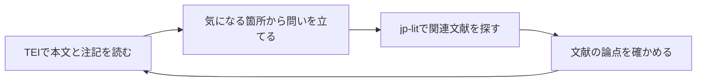

# TEIの使い方: 漱石・古典・歴史史料を探して読む

TEIは、文学作品や歴史史料の本文に、章・歌・人物・注記・訂正などの情報を付けて扱うための共通の記述方法です。このガイドでは、万葉集の諸本比較や延喜式の数量記述を扱う実際の研究と、廣瀬本万葉集・漱石『こころ』の公開データを紹介します。研究でTEIが果たす役割を知り、jp-litで資料の読解と関連文献の調査を往復する手順を説明します。

初めての方は、次の順に読むと資料を探すところから始められます。保存済みXMLがある方は[導入](#導入)を確認し、[AIに依頼して読む](#aiに依頼して読む)へ進めます。

1. [TEIとは何か](#teiとは何か)
2. [研究・読解に使う具体例](#研究読解に使う具体例)
3. [公開されているTEIの例](#公開されているteiの例)
4. [jp-litが支える作業](#jp-litが支える作業)
5. [TEI読解と文献調査を往復する](#tei読解と文献調査を往復する)
6. [jp-litで公開TEIを探す](#jp-litで公開teiを探す)
7. [導入](#導入)
8. [AIに依頼して読む](#aiに依頼して読む)
9. [結果を確認して研究記録へ残す](#結果を確認して研究記録へ残す)
10. [読解が進まないとき](#読解が進まないとき)

## TEIとは何か

TEIは**Text Encoding Initiative**の略です。TEI Consortiumが、人文学資料を電子的に記録・交換するためのガイドラインを整備しています。本文をXMLという形式で記述し、「ここは段落」「この語は人物名」「この部分は後から書き加えられた」といった情報をタグで付けます。このガイドで扱う「TEIデータ」「TEI/XML」は、その記述方法を使って作成されたXMLファイルです。[TEIの公式紹介](https://tei-c.org/about/)と[XMLの入門](https://tei-c.org/release/doc/tei-p5-doc/en/html/SG.html)で基本を確認できます。

たとえば、漱石作品の人物や場所を調べる場面を考えてみます。次は説明用に作った模式例です。

```xml
<p xmlns="http://www.tei-c.org/ns/1.0">
  <persName ref="#watakushi">私</persName>は
  <placeName>鎌倉</placeName>で
  <persName ref="#sensei">先生</persName>と話した。
</p>
```

`p`は段落、`persName`は人物名、`placeName`は地名です。`ref="#sensei"`は、同じXML内の`sensei`というIDへの参照を表します。本文の文字に加えて、誰を指す語か、どこを指す語かを記録できるため、人物の登場箇所を抜き出したり、地名をたどったりする材料になります。模式例の文は『こころ』の引用ではありません。

| TEIに記録できる情報 | タグの例 | 読解で役立つこと |
| --- | --- | --- |
| 章・節・段落 | `div`、`head`、`p` | 読む範囲を絞り、元の位置へ戻る |
| 歌・詩行 | `lg`、`l` | 歌単位・行単位で本文や訓を確認する |
| 人物・地名・発話 | `persName`、`placeName`、`said` | 登場人物や会話、場所の記述をたどる |
| 原表記・正規化表記、誤記・訂正 | `choice`の`orig/reg`、`sic/corr` | どちらの表記を採用したかを説明する |
| 削除・加筆・注記 | `subst`、`del`、`add`、`note` | 書き入れや訂正を本文と区別して読む |
| 底本・編者・作成方針 | `teiHeader`内の記述 | 何をもとに誰が作ったデータかを調べる |

**TEIには、データを作った人の判断も記録されています。** 人物の同定、章の分け方、正規化や訂正の採用は、そのデータの作成方針に依存します。すべてのTEIに上の情報がそろうわけではなく、同じ作品でも底本やタグ付けが違います。研究では本文とともに、編者・底本・対象範囲・作成方針を読みます。

## 研究・読解に使う具体例

### 万葉集の諸本比較で、訓の違いを研究する

**「上代語の用例を数えるとき、どの校訂本文の訓を使うか」は、研究の結果に関わる問いです。** 小池俊希・大向一輝・鴻野知暁・永崎研宣（2020）[『日本語歴史コーパス』へのTEI適用に基づく諸本比較――『万葉集』における「読添えのモ」を事例として――](https://ipsj.ixsq.nii.ac.jp/records/204868)（研究報告CH、2020-CH-123(2)、1–6頁）は、本文の漢字列に「モ」を表す文字がなく、訓で補って読む例を取り上げています。

論文では、写本・版本・注釈書・現代の校訂本文の異同を、TEIの`app`、`lem`、`rdg`と、どの本に基づくかを指す`wit`属性で記録しています。漢字列の本文と訓も区別し、TEI Critical Apparatus Toolboxで違いを対照します。第4節・5頁では、第335番の訓が現代の校訂本文間でも異なる例と、第2366番で近世までの訓と現代の訓を比較する例を示しています。第2366番では「イモニアハムカモ」と「イモモアハヌカモ」の違いがあり、助詞「モ」の扱いも変わります。著者らは、このような異同があるとき、一つの校訂訓を確実な上代語の用例として集計することに注意を促しています。

TEIはここで、**どの本の本文・訓を、どの箇所で比較したかを保つ**役割を担っています。jp-litは関連研究の探索と、入手できたXMLの該当箇所・タグの確認を支援します。異同の対照表示には論文で用いたような専用ツール、用例の集計には別の分析が必要です。論文4頁には現代校訂テキストの共有に権利上の制約があるとの説明もあり、この比較XMLの公開先は今回確認できていません。下記の廣瀬本XMLは別のプロジェクトのデータで、論文の比較をそのまま再現するものとして扱いません。

### 漱石『こころ』で人物と発話をたどる

[Digital Soseki Projectの『こころ』TEI](https://github.com/Yosh-Hibi/digital-soseki/blob/52db835185c05aac0e1ca62e8f465de612041c6e/data/tei/soseki/digital-soseki-kokoro-tei.xml)では、「上　先生と私」「中　両親と私」「下　先生と遺書」が章の区切りとして記録され、その内側に節と段落があります。人物名の`persName`、発話の`said`、地名の`placeName`なども付いています。

たとえば「『私』と『先生』の関係が、冒頭の語りと会話でどう描かれるか」を読むなら、まず「上　先生と私」の最初の節を取り出します。本文の流れを読みながら、誰の発話としてタグ付けされているか、人物名の参照がどう付いているかを確認し、気になる箇所へ戻れる位置を残します。

jp-litは、章・節を一覧にして該当箇所を抽出し、人物・発話のタグを保った読解材料を作れます。登場人物への帰属や分類タグはデータ側の注釈として読み、作品解釈は本文と照合して組み立てます。公開者もタグ付け精度の修訂を予定しています。[研究代表者の紹介](https://hibi.hatenadiary.jp/entry/2026/06/18/160325)から、プロジェクトの目的と公開範囲を確認できます。『こころ』は、人物・発話のタグに慣れるための入門例として使えます。

### 廣瀬本万葉集で歌本文・訓・書き入れを分けて読む

[廣瀬本万葉集の公開TEI](https://github.com/kokubunken/nijl-manyoshuTEI)は、写本の翻刻と書き入れを構造化した例です。確認した[XMLの版](https://github.com/kokubunken/nijl-manyoshuTEI/blob/1ac23ae48ded9f832823b96b9cb54d1d86852ddc/manyo_hirose_v06_0001-0234,3348-3577_202603.xml)では、国歌大観番号4に対応する`lg`のIDが`manyo0004`で、その内側に本文の`l`と訓の`l`があり、`corresp`で対応付けられています。

このデータの利用を学ぶ入口に、[「廣瀬本万葉集TEI/XMLデータ分析入門」](https://dhportal.ac.jp/?p=1533)があります。教材を報告した菊池信彦ほか（2023）[「和歌のXML/TEIデータ分析のための自主学習環境の構築」](https://ipsj.ixsq.nii.ac.jp/records/224182)（研究報告CH、2023-CH-131(8)、1–3頁）の第3節・2頁では、歌や人物名に加え、**書き入れの由来と位置**に着目して情報を抽出する構成を説明しています。教材とデータの構築を扱う報告として読み、伝本研究の新たな結論を示す論文とは区別します。下の[往復する例](#tei読解と文献調査を往復する)では、同じ着眼点で公開XMLを読みます。

たとえば「第4番の本文と訓を対応させて読みたい」「ある歌の訂正や書き入れを、本文へ混ぜずに確認したい」という問いに使えます。jp-litで歌を特定し、本文・訓・注記をそれぞれの要素と位置を保って取り出します。別の歌に進む際も、番号だけで決めず、そのXML内で一致する候補を確認します。

表記の選択や訂正を記録したTEIでは、次のような構造も現れます。こちらは意味を説明する自作の模式例です。

```xml
<choice xmlns="http://www.tei-c.org/ns/1.0">
  <orig>けふ</orig><reg>きょう</reg>
</choice>
```

`orig`は原表記、`reg`は正規化した表記を表します。jp-litのreaderは両方を保持します。原表記で読むか、読みやすい表記へ整えるかを後から選び、その選択を研究ノートへ記録できます。廣瀬本の確認版には、`subst`の中で`del`と`add`を組み合わせた訂正、`note`の注記、画像との対応もあります。画像を見ながら読む際は、公開元の[廣瀬本萬葉集ビューワ](https://tei.pages.nijl.ac.jp/manyoshuteiviewer/)が入口になります。

### 延喜式で品目・数量・単位を読み分ける

**延喜式の物品と数量を調べる例では、何を一つの数量記述と認めるかが重要になります。** 小風尚樹・後藤真（2019）[「『延喜式』へのTEI適用と日本史資料のテクストデータ共有・流通」](https://rekihaku.repo.nii.ac.jp/records/2511)（国立歴史民俗博物館研究報告218、315–327頁）の321–322頁では、`measure`に品目・数量・単位を記録する方法を示しています。321頁の例は「広席二百八十枚」を`commodity="広席"`、`quantity="280"`、`unit="枚"`として区別します。著者らは「春一日」のような日付・期間と物品数量の区別に人の判断が必要なことも説明しています。史料から数量を分析できるデータを作る研究例として読めます。

国立歴史民俗博物館は現在、[延喜式の校訂文・現代語訳・英訳のTEIデータの案内](https://khirin-r.rekihaku.ac.jp/doku.php?id=%E5%BB%B6%E5%96%9C%E5%BC%8Ftei%E3%83%87%E3%83%BC%E3%82%BF%E3%82%BB%E3%83%83%E3%83%88)も公開しています。jp-litでは保存したXMLの項目を読み、数量や注記の記述を原文と照合する作業へつなげられます。現在の公開XMLに論文と同じ数量タグがあるかは、取得した版で調べます。このガイドで紹介するのはデータ構築の方法で、物品の総量や移動経路を分析し終えた結果ではありません。

日記や書簡なら、記録の一項目を抽出して日付・人物・場所・校訂注を確認する使い方が考えられます。これは読解の提案で、利用できるタグや本文と訳の対応方法は資料ごとに調べます。日付の換算、人物同定、訳の評価、底本との校合は、原資料に戻って判断します。

## 公開されているTEIの例

以下は2026年10月3日に公開元の案内を確認した、探索の入口です。研究上の問いに合うデータを選び、収録範囲と底本を確かめてから使います。

| 公開資料・入口 | どんなデータか | 研究・読解の出発点 |
| --- | --- | --- |
| [デジタル漱石](https://github.com/Yosh-Hibi/digital-soseki/tree/main/data/tei/soseki) | 『吾輩は猫である』『坊つちやん』『こころ』『明暗』など長篇14作品のTEI | 章・節をたどり、人物・発話などのタグを本文と照合する |
| [廣瀬本万葉集](https://github.com/kokubunken/nijl-manyoshuTEI) | 写本の翻刻、訓、書き入れなどを扱うTEI。公開範囲はファイルごとに確認する | 歌本文と訓、訂正・注記、底本画像の関係を読む |
| [校異源氏物語テキストDB](https://kouigenjimonogatari.github.io/) | 『校異源氏物語』に基づくTEI/XMLと底本画像への対応 | 帖別の本文や和歌を読み、底本の該当箇所へ戻る |
| [延喜式TEIデータセット](https://khirin-r.rekihaku.ac.jp/doku.php?id=%E5%BB%B6%E5%96%9C%E5%BC%8Ftei%E3%83%87%E3%83%BC%E3%82%BF%E3%82%BB%E3%83%83%E3%83%88) | 校訂文・現代語訳・英訳をTEI化した歴史史料 | 項目単位の読解と本文・訳の対照を始める |

このreaderで構造と操作を確認した実資料は、上で版を示した『こころ』と廣瀬本万葉集です。源氏物語・延喜式は公開案内を確認した探索候補で、このガイドでreader動作を検証した資料には含めていません。新しいXMLでは、まず文書検査と構造一覧から始めます。

## jp-litが支える作業

jp-litは、研究の問いから資料を探し、保存したTEIの必要な箇所を読む流れを支えます。AIから文献DBを使う**MCP**、AI用の手順書である**Skill**、手元のXMLを処理するコマンドである**CLI**が、それぞれ次の作業を担います。

| 作業 | jp-litの機能 | 得られるもの |
| --- | --- | --- |
| 作品・底本・関連研究を探す | jp-lit MCPの書誌検索 | 論文・図書・古典籍の候補と出典 |
| 公開TEIを探し、取得版を確かめる | `jp-lit-tei` Skillと通常のWeb検索・公開元の確認 | 公開先、対象範囲、底本、版、利用条件の記録 |
| 保存XMLの構造を調べ、必要な箇所を取り出す | `jp-lit-tei-reader` CLI | 章・歌などの一覧、本文とタグ、元XML内の位置 |
| 読解・比較・引用を組み立てる | 取得した結果を用いる研究者とAI | 原記述と解釈を分けた研究ノート・読解案 |

readerは、文書検査、構造一覧、構造付き抽出、参照点検の4操作を提供します。全文を一度にAIへ渡す前に、読む章や歌を絞って、その範囲の注記や訂正も一緒に確認できます。語の出現集計や複数作品の比較分析は、抽出後の分析として別に行います。

読解結果には、ファイルの版を識別する**SHA-256（hash）**と、XML内の位置を指す**locator**が付きます。hashはファイルの指紋、locatorのXPathは要素へ戻るための道順と考えると使いやすくなります。これらはXMLの版と位置を示し、底本の頁番号はデータ内の頁記述から別に確認します。

本文の採用、人物への発話の帰属、解釈、画像の実見・校合は研究者が確かめます。readerはXML内の記述を保持して返し、画像取得・TEI編集・schema検証は行いません。公開元のビューワで画像と本文を見比べる作業と組み合わせて使います。

## TEI読解と文献調査を往復する

**TEIで読んで気になった語・人物・主題を、jp-litで関連研究へつなぎ、その成果を手掛かりに本文へ戻れます。** たとえば、歌の訓にある訂正を読み、その訂正や書き入れを扱う伝本研究へ進みます。研究の方法を読んでから、同じ着眼点で公開XMLを読む順でも始められます。TEIの位置情報は、調査後に出発点を読み直すために役立ちます。



### 読む・探す・読み直す手順

1. **気になった箇所を残す。** 本文の語、前後の文、注記を読み、作品・底本・取得版とXML内の位置を記録します。readerの抽出結果を残すと、後で同じ箇所へ戻れます。
2. **調べたい問いと検索語を作る。** 「この言葉は人物同士の関係をどう表すか」「この語句にはどんな訓や注釈があるか」のように問いを具体化します。本文にある語と、検索を広げるための関連語は別に記録します。
3. **jp-litで関連文献を探す。** 作品名と語句・主題を組み合わせ、CiNiiやIRDBなどで研究論文を探します。底本・写本の書誌や所在を調べる場合は、国書データベースなどへ進みます。主題研究の検索には、通常「TEI」を加える必要はありません。
4. **文献の確認範囲を示す。** 書誌だけ確認した候補、要旨まで読んだ文献、本文を読んだ文献を分けます。論点や引用は読めた範囲に基づいて示し、本文へのリンクや所蔵も整理します。本文を未確認の候補から、著者の結論を補って説明しないようにします。
5. **同じ箇所を読み直す。** 文献の論点を手掛かりに、出発点の本文と前後を再読します。本文から言えること、データ作成者の注釈、先行研究の主張、自分の解釈を区別し、残った疑問から次の検索へ進みます。

### 廣瀬本万葉集の訂正・異訓から、伝本研究へ

**「同じ歌の訓が、書き入れや訂正によってどう変わるか」を、実データと研究の方法をつないで考えます。** 上で紹介した[廣瀬本の教材](https://dhportal.ac.jp/?p=1533)と菊池ほか（2023）の第3節を入口に、書き入れの由来や位置を保つ意味を読みます。教材はPythonによる抽出を扱い、jp-litではその前段階として、保存XMLの構造と小さな範囲の本文・注記を確認できます。ここで示す依頼は、このガイドが用意した読解例です。

確認した公開XMLでは、第7番の`manyo0007`に、歌本文と訓の`kunmanyo0007_01`があります。訓の訂正`shu0100118`は、`subst`の内側に削除された「ニ」と追加された「ノ」を記録しています。近くの`note0100109`には「或本ニミクサ」という注記もあります。一つの読みだけを取り出すと、この訂正や別の本への言及が見えにくくなります。

読むときは、歌本文、訓、注記、訂正前後を分け、`resp`の由来分類と`place`の位置も確認します。このXMLでは`resp="#定家本"`などが由来を示します。これはデータ作成者の分類として読み、定家本人の筆跡や訂正時期を認定するには原資料と先行研究を別に確認します。

この箇所から、`廣瀬本 万葉集 書き入れ`、`万葉集 第七番 異訓`、`万葉集 秋の野の`などで関連研究を探せます。伝本研究の方法を調べる際は、上で紹介した小池ほか（2020）の書誌から本文へ進みます。その論文の第335番・第2366番は、ここで使う廣瀬本XMLの収録範囲外です。論文の分析と第7番の読解は、比較の方法を学ぶ関係にあるものとして扱います。

文献を読んだら同じ歌へ戻り、研究が扱う底本・訓・書き入れと、今回のXMLの記述を照合します。公開元の[ビューワ](https://tei.pages.nijl.ac.jp/manyoshuteiviewer/)では底本画像も確認できます。読解メモには、XMLにある記述、研究者の主張、自分の解釈、画像で確かめた範囲を分けて残します。

AIへの依頼例（XMLのpathは、自分の保存先へ置き換えます）:

```text
jp-lit-teiを使って、保存した廣瀬本万葉集TEIの底本・作成方針と収録範囲を確認してください。
第7番の候補を確認し、歌本文・訓・書き入れ・訂正を分けて読んでください。
確認版ではmanyo0007、kunmanyo0007_01、shu0100118、note0100109が使われています。
実際の一致と前後を確認し、削除された「ニ」、追加された「ノ」、注記「或本ニミクサ」を
元XMLの位置とともに示してください。由来や位置の属性も読み、解釈と区別してください。
jp-litで「廣瀬本 万葉集 書き入れ」「万葉集 第七番 異訓」などの関連研究を探してください。
菊池ほか（2023）「和歌のXML/TEIデータ分析のための自主学習環境の構築」も参照し、
書誌・要旨・本文のどこまで確認できたかを示してください。
読めた研究を手掛かりに同じ歌を読み直し、本文、写本の書き入れ、そのデータ側の分類、
先行研究の主張、こちらの解釈を分けてください。画像の確認が必要な点と次の問いも残してください。
XML: J:\Research\tei\manyo.xml
```

この往復の実資料確認は、公開XMLの該当構造と、紹介した研究報告の本文までです。上の検索語は依頼用の候補で、このガイドにjp-litでの実検索結果や新たな伝本研究の結論を掲載したものではありません。

### MCPの検索と読解メモをつなぐ

上の往復では、保存XMLをreaderで読み、関連文献の検索にはMCPを使います。次は検索の呼び出し例です。既に調査中ならその`session_id`を`SID`へ渡し、新規調査なら`jp_lit_start_session`で開始して、返されたIDを使います。

```text
jp_lit_search(session_id=SID, source="cinii_articles", query="廣瀬本 万葉集 書き入れ", limit=5)
jp_lit_search(session_id=SID, source="irdb", query="和歌のXML/TEIデータ分析のための自主学習環境の構築", limit=5)
```

研究ノートには、**出発点の本文と位置 → 問いと検索語 → 文献と確認範囲 → 再読で変わった解釈 → 次の疑問**を残します。書誌検索のセッションと、readerの取得版・位置を対応付けて記録すると、どの本文からどの文献へ進んだかを後からたどれます。

## jp-litで公開TEIを探す

### AIへ探索を依頼する

`jp-lit-tei` Skillを導入した、MCPとWeb検索を使えるAIアプリへ、作品名と調べたいことを伝えます。「TEIを探して」という依頼は、**MCPで関連書誌を探し、公開元のTEI/XMLへ進む調査**として扱います。`jp_lit_search`は書誌検索で、TEIファイルの専用横断索引やXMLの自動取得機能は提供していません。

漱石を探す依頼例:

```text
jp-lit-teiを使って、夏目漱石『こころ』の公開TEIを探してください。
まずjp-litで作品の書誌とTEIに関する研究を調べ、公開者の案内からXMLの公開先を確認してください。
底本、対象範囲、タグ付けの方針、取得できる版、利用条件を整理してください。
人物と発話を調べたいので、そのタグがあるかも確認してください。
```

古典を探す依頼例:

```text
jp-lit-teiを使って、万葉集の歌本文・訓・書き入れを読める公開TEIを探してください。
jp-litの書誌検索と公開元のデータ探索を組み合わせ、廣瀬本などの底本を区別してください。
公開されている巻・歌の範囲、XMLの公開先、画像を見られる入口を示してください。
```

### 書誌検索から公開元へ進む

調査は次の順で進めます。

1. **作品・関連研究の書誌を調べる。** CiNiiやIRDBで「TEI 夏目漱石」「万葉集 TEI」などを試し、古典籍の底本・所在は国書データベースなどで確認します。「こころ／こゝろ」「万葉集／萬葉集」の表記違いも別の検索語として試します。
2. **公開データを探す。** 見つけた研究者・機関・プロジェクト名を手掛かりに、通常のWeb検索で「こころ TEI XML」「廣瀬本万葉集 TEI」「延喜式 TEI」などを調べます。GitHubでも`digital-soseki`や`nijl-manyoshuTEI`のような公開プロジェクトを確認します。
3. **公開元の案内とXMLを照合する。** 論文の書誌レコードから、TEIファイルがあると推定せず、データ一覧と実際のXMLを確認します。作品名、底本、編者、収録範囲、利用条件、版を記録します。
4. **読む版を保存する。** GitHubならファイル一覧でXMLを開き、履歴から使う版を確認して、Raw（加工前のファイル）をローカルへ保存します。取得URL・日時・commit ID（GitHubの履歴で版を識別する値）を研究ノートに残し、readerで測ったhashと対応付けます。

MCPを直接呼ぶ場合の検索例です。実際の検索結果を示したものではありません。新規調査を開始し、返された`session_id`を`SID`として各検索へ渡します。

```text
jp_lit_start_session(research_goal="漱石・万葉集の公開TEIと関連研究を探す")
jp_lit_search(session_id=SID, source="cinii_articles", query="TEI 夏目漱石", limit=5)
jp_lit_search(session_id=SID, source="irdb", query="万葉集 TEI", limit=5)
jp_lit_search(session_id=SID, source="kokusho", query="萬葉集", limit=5)
```

各sourceの検索対象と語の扱いは[文献調査Skill](../skills/jp-lit-research/SKILL.md)に従います。書誌検索が0件でも、公開TEIの不存在を意味しません。上の公開資料表から探す方法も併用し、書誌と公開データの対応は作品・底本・範囲の一致で確かめます。READMEやデータの利用条件と、XML内の権利記述に差があれば、両方を記録して公開者の説明を確認します。

## 導入

TEI読解には、`jp-lit-tei` Skillを読み込めてローカルコマンドを実行できるAIアプリを使います。Node.js22以上、[uv](https://docs.astral.sh/uv/getting-started/installation/)、Python3.13.15を用意し、初回に次のコマンドでPythonとSkillsを導入してreaderの起動を確認します。

```sh
uv python install 3.13.15
npx --yes --package=jp-lit-mcp@0.17.0 jp-lit-tei-reader --help
npx --yes jp-lit-mcp@0.17.0 install-skills codex
```

`codex`はCodex CLI / App向けです。Cursorは`cursor`、Claude Codeは`claude`に置き換えます。Skills installerはjp-lit-research、jp-lit-verification、jp-lit-tei、jp-lit-iiifの4種を導入し、既存の同名Skillsも指定版で置き換えます。個別に編集した内容は導入前に退避してください。導入後はアプリで新しい対話を開き、`jp-lit-tei`が利用できることを確認してください。

通常導入の`npx --package=...`は、cloneしたjp-lit repositoryの外で実行してください。npmが同名のローカルpackageを参照すると、readerの実行名が見つからない場合があります。初回にはnpm packageやPythonがダウンロードされることがあります。

ここで指定した`0.17.0`はTEI reader、検索条件・調査方法export、任意IIIF比較画面を含む版です。MCPの書誌検索とIIIF CLIはNode.jsだけで動き、uv/PythonはTEI読解に使います。既存のMCP設定はそのまま利用できます。MCPの登録と、今回のSkill・readerの導入を済ませると、読解と書誌調査を組み合わせられます。TEIのfacs/surface/zoneとIIIF領域の自動対応は後続段階です。

導入後の読解は、XMLの保存先と読みたい内容をAIへ伝えて進めます。要求JSONの作成やreaderの呼び出しはAIが担当するため、利用者がPowerShell関数を書く必要はありません。CLIを直接使う場合や実装を確認する場合は[CLI技術資料](../packages/tei-reader/README.md)を参照してください。

## AIに依頼して読む

導入済みのAIアプリへ、公開元から保存したXMLの場所、読みたい範囲、調べたい問いを伝えます。AIはSkillに従い、XMLの版と章・歌などの区切りを確認し、対象を抽出して参照を点検します。MCPは関連研究の書誌探索に使います。保存済みXMLの読解は、MCPが使えない環境でもSkillとreaderで進められます。

次のpathは例なので、自分の保存先へ置き換えてください。XMLの区切りやIDを知らない場合は、「まず章や歌の一覧を示して」と依頼できます。複数の候補がある場合は、見出しや前後を確かめて対象を選びます。

漱石『こころ』の依頼例:

```text
jp-lit-teiを使って、次の『こころ』TEIの底本・作成方針と章・節の構造を確認してください。
「上　先生と私」の最初の節を抽出し、人物名・発話・地名のタグを保って読解材料にしてください。
誰の発話と記録されているかを本文と照らし合わせ、データ側の注釈とこちらの解釈を分けてください。
元XMLへ戻れる位置と、今回読んだ範囲を残してください。
XML: J:\Research\tei\digital-soseki-kokoro-tei.xml
```

廣瀬本万葉集の依頼例:

```text
jp-lit-teiを使って、次のXMLから国歌大観番号4の候補を探してください。
確認した版ではmanyo0004というIDが使われています。実際の一致件数を確認してから抽出してください。
歌本文と訓を別々に示し、原表記・正規化表記、訂正、注記があれば各要素を保持してください。
画像との対応記述と、画像を実際に確認した状態も分けて記録してください。
XML: J:\Research\tei\manyo.xml
```

歴史史料の依頼例:

```text
jp-lit-teiを使って、次の日記TEIの項目の区切りと日付の記述を確認してください。
対象項目を特定して抽出し、人名・地名・校訂注のタグを原位置付きで示してください。
日付の換算や人物同定は、XMLの記述とこちらの解釈を分けてください。
XML: J:\Research\tei\diary.xml
```

AIには取得版、読む単位、原構造と解釈、画像の実見・校合の状態を残すよう依頼します。本文だけを読みやすく整える場合も、元のタグ付き結果を先に保存すると、採用した表記や注記を後から確かめられます。

## 結果を確認して研究記録へ残す

AIの返答では、読んだ資料と範囲、本文と注釈、研究と解釈をそれぞれ確認します。研究ノートには、次の情報を残してください。

| 確認するもの | 記録する内容 |
| --- | --- |
| 資料と版 | 公開元、底本・収録範囲、保存XMLの場所とhash。hashはAIがreaderで計測した値を記録する |
| 読んだ範囲 | 章・節・歌などの単位と元XMLへ戻れる位置（locator）。前後を読んだ範囲と、上限によって抽出を分けた箇所も記録する |
| 本文とデータ側の注釈 | 原文、異読、訂正、訓、注記を区別する。読みやすい本文を作った場合は採用した表記を明記する |
| 先行研究とこちらの解釈 | 検索語、文献の書誌、要旨・本文の確認範囲と根拠頁、研究の主張、今回の解釈を分ける |
| 参照・画像の確認 | XML内の参照先が見つかった状態、画像の所在記述、画像を実際に見た状態、校合した状態を分ける |

廣瀬本万葉集で訂正や異訓を読むなら、次のように確認を続けられます。

```text
いま読んだ歌について、歌本文・訓・訂正・注記を分けて研究ノートにしてください。
読みやすい本文を作る場合は、採用した表記とその根拠を明記してください。
関連研究の主張には読めた頁を付け、今回の解釈を別に示してください。
元XMLへ戻れる位置、まだ確かめていない参照、次に読む歌や文献も残してください。
```

元XMLの位置は、AIがreaderから受け取ったlocatorを記録します。XMLを差し替えた場合は版を確認し直します。以前の位置を別版へそのまま流用すると、同じ箇所を指しているか確かめられません。

readerは訂正前後や異読の枝を保持します。たとえば「ニ」と「ノ」のどちらを読解用の本文に採用するかは、資料と研究に基づく判断として別記します。文書内の参照が解決していても、外部画像を見たことや原資料との校合が済んだことは別の確認です。

## 読解が進まないとき

読解が止まった場合は、AIへ状況を伝え、次の確認を依頼できます。文書や応答には大きさの上限があるため、大きい章は節・段落・歌などへ分けて読みます。

| 状況 | AIへの追加依頼 |
| --- | --- |
| readerを起動できない | 「Node.js、uv、Pythonとreaderの起動を確認し、不足している準備を教えてください」 |
| XMLを開けない | 「指定した保存先にXMLがあるか、読み取り可能か確認してください」 |
| 対象の章・歌が見つからない | 「実際の区切り、番号、見出しと一致件数を確認し、候補を示してください」 |
| 抽出範囲が大きい | 「章全体を小さい単位に分け、今回は対象の節・歌と必要な前後だけを読んでください」 |
| XMLの版が変わった | 「新しいXMLの版を確認し直し、その版の一覧から対象位置を取り直してください」 |
| 参照が未解決・未確認 | 「元の参照記述と対象範囲を示し、確認できた状態と残った疑問を分けてください」 |

readerはローカルXMLの構造読解を支えます。画像や外部資源の取得、XMLの編集、TEI schema検証は提供範囲から除きます。画像を見比べる作業は公開元のビューワなどで行い、実見した範囲を記録してください。

CLIの要求JSON、手動PowerShell例、応答の仕様と詳細な上限・エラーは[CLI技術資料](../packages/tei-reader/README.md)にまとめています。

[利用ガイド](usage-guide.md) / [公開Skill](../skills/jp-lit-tei/SKILL.md)
